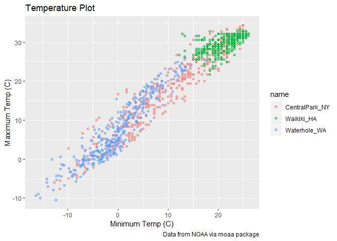
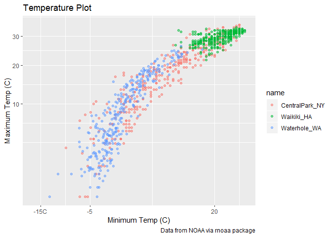
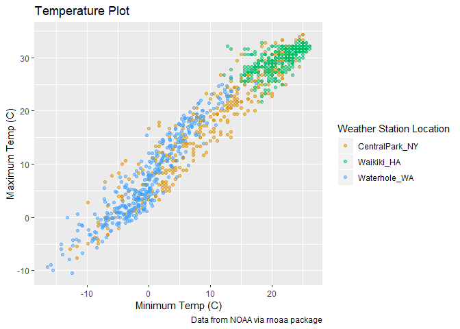
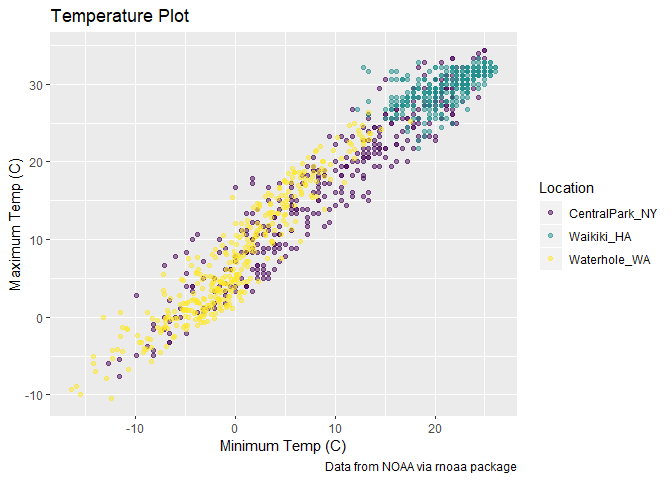
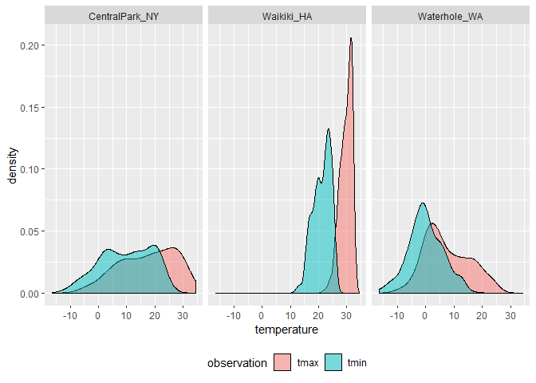

viz\_and\_eda
================
Jared Garfinkel
9/26/2019

``` r
weather_df = 
  rnoaa::meteo_pull_monitors(c("USW00094728", "USC00519397", "USS0023B17S"),
                      var = c("PRCP", "TMIN", "TMAX"), 
                      date_min = "2017-01-01",
                      date_max = "2017-12-31") %>% 
  mutate(
    name = dplyr::recode(id, USW00094728 = "CentralPark_NY", 
                      USC00519397 = "Waikiki_HA",
                      USS0023B17S = "Waterhole_WA"),
    tmin = tmin / 10,
    tmax = tmax / 10) %>%
  select(name, id, everything())
```

    ## Registered S3 method overwritten by 'crul':
    ##   method                 from
    ##   as.character.form_file httr

    ## Registered S3 method overwritten by 'hoardr':
    ##   method           from
    ##   print.cache_info httr

    ## file path:          C:\Users\jared\AppData\Local\rnoaa\rnoaa\Cache/ghcnd/USW00094728.dly

    ## file last updated:  2019-09-26 10:45:54

    ## file min/max dates: 1869-01-01 / 2019-09-30

    ## file path:          C:\Users\jared\AppData\Local\rnoaa\rnoaa\Cache/ghcnd/USC00519397.dly

    ## file last updated:  2019-09-26 10:46:11

    ## file min/max dates: 1965-01-01 / 2019-09-30

    ## file path:          C:\Users\jared\AppData\Local\rnoaa\rnoaa\Cache/ghcnd/USS0023B17S.dly

    ## file last updated:  2019-09-26 10:46:17

    ## file min/max dates: 1999-09-01 / 2019-09-30

## making new plots

start with an old plot

``` r
weather_df %>% 
  ggplot(aes(x = tmin, y = tmax, color = name)) +
  geom_point(alpha = .5) +
  labs(
    title = "Temperature Plot",
    x = "Minimum Temp (C)",
    y = "Maximum Temp (C)",
    caption = "Data from NOAA via rnoaa package"
  )
```

    ## Warning: Removed 15 rows containing missing values (geom_point).

<!-- -->

x axis tick marks etc

``` r
weather_df %>% 
  ggplot(aes(x = tmin, y = tmax, color = name)) +
  geom_point(alpha = .5) +
  labs(
    title = "Temperature Plot",
    x = "Minimum Temp (C)",
    y = "Maximum Temp (C)",
    caption = "Data from NOAA via rnoaa package"
  ) +
  scale_x_continuous(
    breaks = c(-15,-5,20),
    labels = c("-15C", "-5", "20")
  ) +
  scale_y_continuous(
    trans = "sqrt"
  )
```

    ## Warning in self$trans$transform(x): NaNs produced

    ## Warning: Transformation introduced infinite values in continuous y-axis

    ## Warning: Removed 90 rows containing missing values (geom_point).

<!-- -->

## colors next

``` r
weather_df %>% 
  ggplot(aes(x = tmin, y = tmax, color = name)) +
  geom_point(alpha = .5) +
  labs(
    title = "Temperature Plot",
    x = "Minimum Temp (C)",
    y = "Maximum Temp (C)",
    caption = "Data from NOAA via rnoaa package"
  ) +
  scale_color_hue(
    name = "Weather Station Location",
    h = c(50, 250)
  )
```

    ## Warning: Removed 15 rows containing missing values (geom_point).

<!-- -->

``` r
ggp_base =
weather_df %>% 
  ggplot(aes(x = tmin, y = tmax, color = name)) +
  geom_point(alpha = .5) +
  labs(
    title = "Temperature Plot",
    x = "Minimum Temp (C)",
    y = "Maximum Temp (C)",
    caption = "Data from NOAA via rnoaa package"
  ) +
  viridis::scale_color_viridis(
    name = "Location",
    discrete = TRUE
  )

ggp_base
```

    ## Warning: Removed 15 rows containing missing values (geom_point).

<!-- -->

## themes

``` r
ggp_base +
  theme_minimal() +
  theme(legend.position = "none")
```

    ## Warning: Removed 15 rows containing missing values (geom_point).

<!-- -->

where do my warnings come from

``` r
weather_df %>% 
  filter(is.na(tmin))
```

    ## # A tibble: 15 x 6
    ##    name       id          date        prcp  tmax  tmin
    ##    <chr>      <chr>       <date>     <dbl> <dbl> <dbl>
    ##  1 Waikiki_HA USC00519397 2017-04-17     5  28.3    NA
    ##  2 Waikiki_HA USC00519397 2017-05-09    NA  NA      NA
    ##  3 Waikiki_HA USC00519397 2017-05-26    NA  NA      NA
    ##  4 Waikiki_HA USC00519397 2017-07-19    NA  NA      NA
    ##  5 Waikiki_HA USC00519397 2017-10-07     0  31.1    NA
    ##  6 Waikiki_HA USC00519397 2017-10-09     0  28.9    NA
    ##  7 Waikiki_HA USC00519397 2017-10-10    10  31.7    NA
    ##  8 Waikiki_HA USC00519397 2017-10-12     0  31.1    NA
    ##  9 Waikiki_HA USC00519397 2017-10-13     0  31.1    NA
    ## 10 Waikiki_HA USC00519397 2017-10-16     5  30      NA
    ## 11 Waikiki_HA USC00519397 2017-10-18     0  29.4    NA
    ## 12 Waikiki_HA USC00519397 2017-10-20    13  30.6    NA
    ## 13 Waikiki_HA USC00519397 2017-10-21     0  30      NA
    ## 14 Waikiki_HA USC00519397 2017-10-22     0  30      NA
    ## 15 Waikiki_HA USC00519397 2017-12-22     0  26.7    NA

more fun with ggplot

``` r
central_park = 
  weather_df %>% 
  filter(name == "CentralPark_NY")

waikiki =
  weather_df %>% 
  filter(name == "Waikiki_HA")

ggplot(data = waikiki, aes(x = date, y = tmax, color = name)) +
  geom_point(aes(size = prcp)) +
  geom_line(data = central_park)
```

    ## Warning: Removed 3 rows containing missing values (geom_point).

<!-- -->

brief aside about colors

``` r
waikiki %>% 
  ggplot(aes(x = date, y = tmax)) +
  geom_point(alpha = .5, color = "blue")
```

    ## Warning: Removed 3 rows containing missing values (geom_point).

<!-- -->

## Multi-panel plots

``` r
ggp_scatter = 
  weather_df %>% 
  ggplot(aes(x = tmin, y = tmax)) +
  geom_point()

ggp_density = 
  weather_df %>% 
  ggplot(aes(x = tmin)) +
  geom_density()

ggp_box = 
  weather_df %>% 
  ggplot(aes(x = name, y = tmax, color = name)) +
  geom_boxplot()

# CRAN patchwork
# ggp_scatter + ggp_density / ggp_box
```

``` r
  weather_df %>% 
  mutate(
    name = factor(name),
    name = fct_relevel(name, "Waikiki_HA", "CentralPark_NY")
  ) %>% 
  ggplot(aes(x = name, y = tmax, color = name)) +
  geom_boxplot()
```

    ## Warning: Removed 3 rows containing non-finite values (stat_boxplot).

<!-- -->

## restructure then plot

``` r
weather_df %>% 
  pivot_longer(
    tmax:tmin,
    names_to = "observation",
    values_to = "temperature"
  ) %>% 
  ggplot(aes(x = temperature, fill = observation)) +
  geom_density(alpha = .5) +
  facet_grid(~name) +
  theme(legend.position = "bottom")
```

    ## Warning: Removed 18 rows containing non-finite values (stat_density).

<!-- -->
